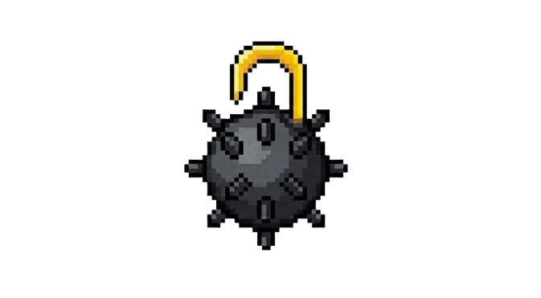

# OpenSweeper

<p align="center">
  
</p>

A modern, mobile-first Minesweeper game built with Flutter. Features the classic OG Minesweeper look with a modern twist, dark/light theme support, and comprehensive statistics tracking.

## Features

- 🎮 **Classic Minesweeper Gameplay** - Tap to reveal, long-press to flag
- 🛡️ **First-Click Safe** - Your first click is always safe (no mines on or around the first revealed cell)
- 🌓 **Dark & Light Mode** - Toggle between themes with one tap
- 📊 **Statistics Tracking** - All games are stored in SQLite with win/loss, time, difficulty
- 📤 **CSV Export** - Export your game history to CSV and share/save it
- 📱 **Mobile-First Design** - Responsive layout optimized for touch devices
- 🔍 **Pinch-to-Zoom** - Zoom in/out on larger grids for easier navigation
- 🔒 **Lock Mode** - Pan and zoom without accidentally tapping cells
- ⚡ **Customizable Flag Delay** - Adjust hold duration (50-500ms) for faster flagging
- 🎚️ **Multiple Difficulties** - Beginner (9×9), Intermediate (16×16), Expert (30×16), or Custom

## Screenshots

| Light Mode | Dark Mode |
|------------|-----------|
|  |  |

## Getting Started

### Prerequisites

- Flutter SDK (3.10+)
- Dart SDK (3.0+)

### Installation

```bash
# Clone the repository
git clone https://github.com/yourusername/opensweeper.git
cd opensweeper

# Install dependencies
flutter pub get

# Run the app
flutter run
```

## Project Structure

```
lib/
├── main.dart                    # App entry point & navigation
├── game/
│   ├── board.dart               # Game board logic (reveal, flag, win/loss)
│   ├── cell.dart                # Cell model
│   ├── difficulty.dart          # Difficulty presets
│   └── game_provider.dart       # State management
├── data/
│   ├── stats_database.dart      # SQLite database for game records
│   └── csv_exporter.dart        # CSV export utility
├── theme/
│   ├── app_theme.dart           # Light/dark theme definitions
│   └── theme_provider.dart      # Theme state management
└── ui/
    ├── screens/
    │   ├── game_screen.dart     # Main game screen
    │   └── stats_screen.dart    # Statistics screen
    └── widgets/
        ├── cell_widget.dart     # Individual cell rendering
        ├── game_header.dart     # Mine counter, timer, face button
        └── difficulty_dialog.dart
```

## Gameplay

- **Tap** a cell to reveal it
- **Long-press** a cell to toggle flag
- **Double-tap** a revealed number to chord (reveal all unflagged neighbors if flag count matches)
- **Tap the face** to restart the game
- **Tap the gear** to change difficulty

## Statistics

Games are automatically recorded when finished. View your stats in the Stats tab:

- Total games played
- Win rate percentage
- Best time (for wins)
- Average time (for wins)
- Full game history with filters

### CSV Export

Tap the download icon in the Stats screen to export your game history as a CSV file. The export includes:

- Game ID
- Difficulty
- Board dimensions
- Mine count
- Win/Loss status
- Duration in seconds
- Timestamp
- Random seed

## Dependencies

- [provider](https://pub.dev/packages/provider) - State management
- [sqflite](https://pub.dev/packages/sqflite) - SQLite database
- [path_provider](https://pub.dev/packages/path_provider) - File system access
- [csv](https://pub.dev/packages/csv) - CSV generation
- [share_plus](https://pub.dev/packages/share_plus) - File sharing
- [intl](https://pub.dev/packages/intl) - Date formatting

## Contributing

Contributions are welcome! Please feel free to submit a Pull Request.

## License

This project is open source and available under the [MIT License](LICENSE).

## Acknowledgments

- Inspired by the original Microsoft Minesweeper
- Built with Flutter ❤️
